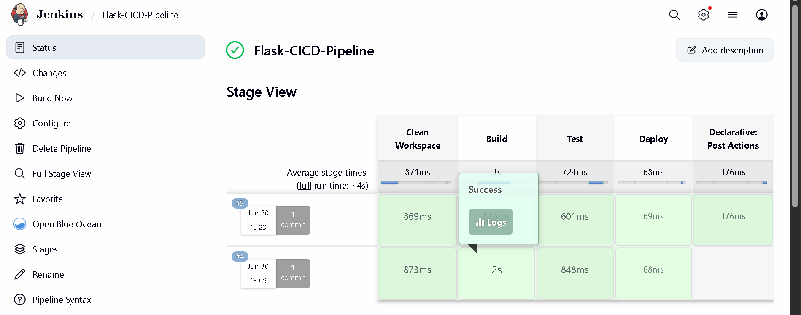
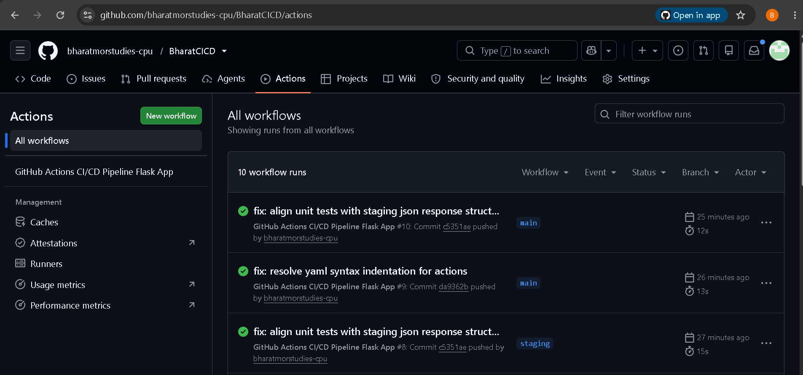

Set-Content -Path "README.md" -Value @'
# Multi-Track CI/CD Pipeline Automation Project

A robust, enterprise-grade continuous integration and continuous deployment (CI/CD) pipeline infrastructure for a Python Flask web application. This architecture implements parallel automation strategies utilizing an on-premises **Jenkins Declarative Pipeline** track and a cloud-native **GitHub Actions Workflow** matrix.

---

## 📂 Project Architecture & Layout

```text
flask-cicd-app/
├── .github/workflows/
│   └── cicd.yml           # GitHub Actions Multi-Branch Orchestration Schema
├── snapshots/
│   ├── Git_hub_success.png               # Verified GitHub Actions Execution
│   └── Jenkin_Success_flask-cicd-app.png # Verified Jenkins Pipeline Stage View
├── tests/
│   └── test_app.py        # Automated Pytest Functional Validation Suite
├── app.py                 # Microservice Application Layer & Core Routes
├── Jenkinsfile            # Programmatic Infrastructure-as-Code Pipeline
└── requirements.txt       # Frozen Environment Dependencies
```

---

## 🛠️ Prerequisites & Environmental Settings
* **Runtime Environment**: Python 3.10+
* **Automation Automation Framework**: Jenkins LTS (with Pipeline, Git, and Workspace Cleanup plugins provisioned)
* **Source Control Management**: GitHub Repository Access Matrix

---

## ⚙️ Automated Integration Infrastructure

### 🚀 Track 1: Jenkins Declarative Pipeline
The programmatic orchestration file (`Jenkinsfile`) manages isolated, repeatable local deployment cycles.
* **Workspace Isolation**: Triggers explicit `cleanWs()` parameters during initialization stages to wipe out legacy caching data structures.
* **Global Dependency Processing**: Avoids local virtual environment constraints by deploying packages using strict container fallback flags.
* **Functional Test Runner**: Validates endpoint stability natively via `pytest` suites.
* **State Management**: Modifies `currentBuild.result` parameters to capture exact pipeline execution states cleanly on the primary dashboard views.

#### 📊 Jenkins Execution Verification


---

### 🌐 Track 2: GitHub Actions Cloud Workflows
The cloud-native validation configuration (`.github/workflows/cicd.yml`) establishes granular execution rules contingent on branching behaviors:
1. **Staging Environment Automation**: Committing modifications directly to the `staging` branch spins up an isolated `ubuntu-latest` image matrix to run dependencies, compile apps, and mock staging delivery layers.
2. **Production Lifecycle Deployment**: Tagging releases (utilizing the format rule `v*`) bypasses staging checks to initiate final delivery scripts targeting live configuration scopes.
3. **Engine Compatibility Runtime Patches**: Integrates `FORCE_JAVASCRIPT_ACTIONS_TO_NODE24: "true"` arguments natively to resolve modern node deprecation constraints across active enterprise virtualization platforms.

#### 📊 GitHub Actions Execution Verification


---

## 🔐 Cryptographic Actions Configuration Secrets
To allow continuous orchestration, register the following parameters within your repository via **Settings ➔ Secrets and variables ➔ Actions**:
* `STAGING_API_TOKEN`: Cryptographic authorization parameter targeting cloud staging infrastructure layers.
* `PROD_DEPLOY_KEY`: Isolated SSH private deployment artifact pointing to production endpoints.
'@ -Encoding utf8
